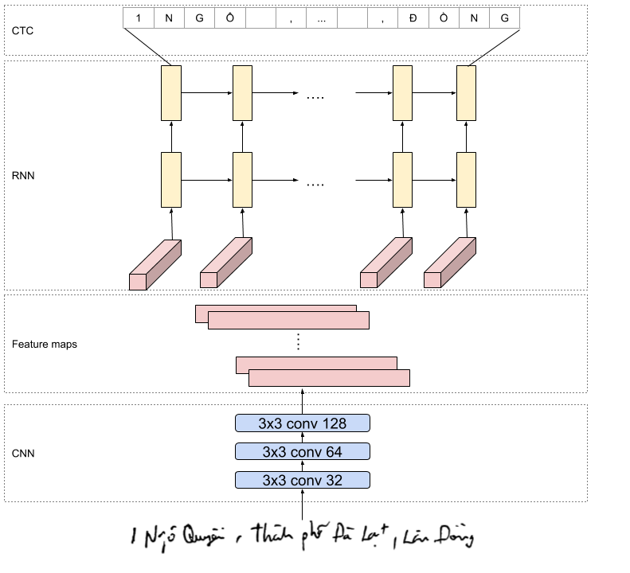

# CINNAMON AI MARATHON
# Giới thiệu
Cinnamon AI Marathon là một giải đấu kết hợp với lộ trình huấn luyện đầy thử thách hướng tới các "vận động viên" mang khát vọng chinh phục những bài toán thực tế trong lĩnh vực Trí Tuệ Nhân Tạo. Đặc biệt, Cinnamon AI Marathon 2018 MỞ RỘNG cho cả các tài năng nằm ngoài lãnh thổ Việt Nam.
Trong cuộc thi này gồm 3 challenges:
- [Handwriting OCR for Vietnamese Address](https://goo.gl/PHJCit)
- [Document Layout Analysis](https://goo.gl/wHi5DK)
- [Real Time Facial LandMark Detection](https://goo.gl/gcp77y)

** update: Mình cập nhật source code mô hình top 1 tại cuộc thi và pretrain tại [bitbucket](https://bitbucket.org/pbcquoc/ocr/src/master/)

# Dataset
Các bạn download dataset của BTC tại [đây](https://drive.google.com/drive/folders/1Qa2YA6w6V5MaNV-qxqhsHHoYFRK5JB39) nhé. 

# Preprocess
Tiền xử lý là cực kì quan trọng đối với bài toàn này. Một trong những cách mà các bạn có thể thử:
- Binary bản scan
- Remove white border 
# Model
Một trong những kiến trức cơ bản hay dùng cho bài toán OCR là CRNN + CTCLoss. CNN được dùng để extract features từ ảnh. sau đó các feature maps trở thành input đầu vào cho mạng RNN. mỗi feature map sẽ tương ứng với một timestep của mạng RNN. Sau đó dùng CTCLoss để tính loss tại một thời điểm và cập nhật lại trọng số cho cả mô hình.
CNN, RNN thì các bạn đã quen thuộc. Trong bài này mình thấy điểm thú vị làm hàm CTCloss, hàm này giúp tính loss hiện tại của mô hình mà không thông tin về align của những kí tự trong ảnh. Chi tiết về CTCloss bạn có thể tìm hiểu tại [đây](https://distill.pub/2017/ctc/)

# Train
Model hình của mình dùng vgg16 và Bidirection LSTM, có tổng 20m tham số, nên quá trình train để hạn chết overfit là cực kì quan trọng. Đầu tiên, các bạn cần fix CNN, chỉ train LSTM, sau đó thì train cả mô hình với learning rate nhỏ hơn. Mình train khoảng 60 epochs cho LSTM với lr=0.001, và 30 epochs tiết theo để finetune với lr=0.00001

Các bạn gõ câu lệnh sau để train:
```python
python crnn.py --train {thư mục chứa ảnh} --label {nhãn.json}
```
Các bạn gõ câu lệnh sau để predict:
```python
python predict.py --model {thư mực chứa kfold model} --data {thư mục chứa ảnh cần predict}
```

# Result
Kết quả mình sau khi train 60 epochs + 31 epochs cho finetune. Mình tính editdistance trên tập valid 1/5 training size thì được normalize editdistance khoảng 0.28x

Chi tiết mô hình các bạn có thể đọc tại [blog](https://pbcquoc.github.io/vietnamese-ocr/) của mình nhé. 
# Any Problem?
Nếu bạn có vấn đề gì thì liên hệ với mình qua gmail pbcquoc@gmail.com. 
